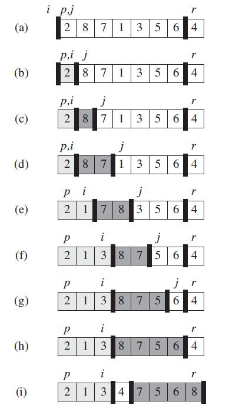

## 快排
>参考书籍 《算法导论》

#### 快排特点
- 分治思想
- 原址排序
- T(n)=nlgn

#### 快排缺点
- 最坏时间复杂度 T(n)=n^2
- 不稳定排序

#### 快排步骤：
**Partition**
1.取基准数x，一般取最后一个
`base=A[n]`
2.小于base基数的放在左边，大于基数的base放在右边
3.base放到两数之间，base就已经排好了序

**QuickSort**
- 除去base，左右两边分治，递归调用，快排完成



----

#### C++代码
```C++
/* filename: Quick_sort.cpp
*
* Author:   xblin
*/

#include <iostream>
using namespace std;

/************** 数组的划分函数 **************************/
int Partition(int A[], int left, int right){
	int base = A[right];    //取最后一个为基准数
	int j = left;           //location
	for (int i = left; i < right; i++){
		if (A[i] < base)                  //小于base的放左边，大于base的放右边
			std::swap(A[i], A[j++]);      //标准库的交换变量函数
	}
	std::swap(A[j], A[right]);            //base放到两数之间

	return j;   //返回中间base的下标
}

/************** 快排的递归调用函数 *****************/
void QuickSort(int A[], int left, int right){
	if (left < right){
		int base = Partition(A, left, right);
		QuickSort(A, left, base - 1);
		QuickSort(A, base + 1, right);
	}
}

int main(int argc, char **argv){
	int aa[] = { 2, 8, 7, 1, 3, 5, 6, 4 };
	int Array_size = sizeof(aa) / sizeof(int); 

	QuickSort(aa, 0, Array_size-1);    //快排
	for (int i = 0; i < Array_size; i++)
 		cout << aa[i] << endl;
}
```

----

## 快排的优化

快排最坏情况下的时间复杂度T(n)=n2，
eg：6,5,4,3,2,1；  且base取最后一个1。
要减小此概率的发生，base就要随机取一个

添加伪代码：
思想：先随机取一个base，交换放到数组最后就行，然后正常调用Parition函数。
```
Random_partition(A, l, r)
    i=Random(l, r)
    swap(A[r], A[i])
    return Partition(A, l, r)
```
