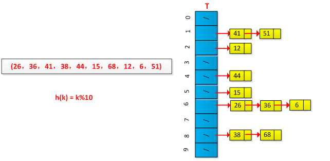

## 散列表
> 参考 《算法导论》

散列表(hash table)是从一个集合A到另一个集合B的映射(mapping)。

**区别与直接寻址表（数组表）：**
如果全域U很大，则要开辟的内存空间就要很大。但实际集合K相对U来说可能很小，所以开辟的空间就会浪费。

#### 散列表冲突解决
- 链接法
- 开放寻址法
- 字符串hash

**1. 链接法**
　　将所有关键字为同义词的结点链接在同一个链表中。若选定的散列表长度为m，则可将散列表定义为一个由m个头指针组成的指针数组T[0..m-1]。凡是散列地址为i的结点，均插入到以T[i]为头指针的单链表中。T中各分量的初值均应为空指针。在拉链法中，装填因子α可以大于1，但一般均取。

**2. 开放寻址法**
    冲突元素探测时从i=0开始，首先探查T[h'(k)]，然后依次探测T[h'(k)+1]，…，直到T[h'(k)+m-1]，此后又循环到T[0]，T[1]，…，直到探测到T[h'(k)-1]为止。装载因子α≤1。

探查：
- 线性探查
- 二次探查
- 双重探查

缺点： 删除元素比较困难

#### 散列函数（映射）
- 除法散列
- 乘法散列
- 全域散列 

#### 散列表应用
1. 保存密码
计算机的登陆密码，一般是一串字符。然而，为了安全起见，计算机不会直接保存该字符串，而是保存该字符串的hash值(使用**MD5**、**SHA**或者其他算法作为hash函数)。当用户下次登陆的时候，输入密码字符串。如果该密码字符串的hash值与保存的hash值一致，那么就认为用户输入了正确的密码。这样，就算黑客闯入了数据库中的密码记录，他能看到的也只是密码的hash值。上面所使用的hash函数有很好的单向性：很难从hash值去推测键值。
 
2. git内容变化
git中，文件内容为键值，并用SHA算法作为hash function，将文件内容对应为固定长度的字符串(hash值)。如果文件内容发生变化，那么所对应的字符串就会发生变化。git通过比较较短的hash值，就可以知道文件内容是否发生变动。
