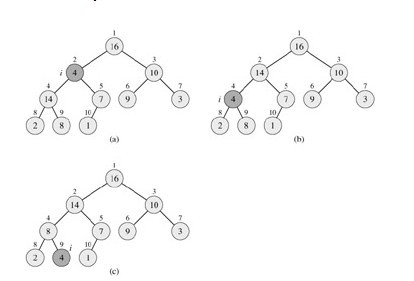
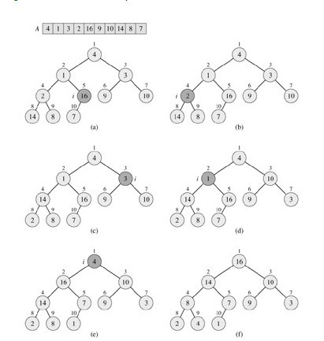
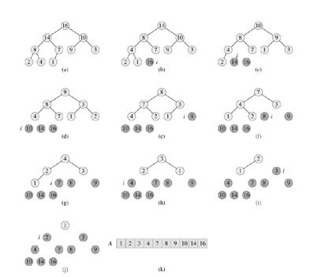

## 堆排序

>参考书籍： 《算法导论》

#### 堆排序特点
- 原址排序
- 不稳定排序
- T(n)=nlgn

#### 堆排序缺点
1. 最大的也是唯一的缺点就是——堆的维护问题，实际场景中的数据是频繁发生变动的，而对于待排序序列的每次更新（增，删，改），我们都要重新做一遍堆的维护，以保证其特性，这在大多数情况下都是没有必要的
2. 每次移出堆顶最大元素后，都需要从顶部维护最大堆性质导致了过多的数据交换操作。
3. 插入一个元素后（加到堆最后），又要重新进行整个堆算法。
#### 堆排序的总过程：
一.确定父结点，左右孩子；
二.维护最大堆 O(n)=lgn;
三.建立最大堆
四.堆排算法 T(n)=nlgn

----
#### 1. 完全二叉树 <--> 数组

#### 2.确定父结点，左孩子，右孩子
```C++
#define Parent(i) ((i-1)/2)    //父结点
#define Left(i)   (i*2+1)      //左孩子
#define Right(i)  (i*2+2)      //右孩子
```
#### 3.维护最大堆
最大堆： 所有结点满足 父结点的值要大于左右孩子的值；
         A[Parent] > A[i]

**C++代码：**
```C++
/***************维护最大堆函数*****************/
void Max_Heapify(int A[], int i, int Heap_size){
	int left = Left(i);      //左孩子
	int right = Right(i);    //右孩子
	int largest_num = i;     //存放最大值的下标

	if (left < Heap_size && A[left] > A[i]){
		largest_num = left;
	}
	if (right < Heap_size && A[right] > A[largest_num]){      //注意：这里一定要是largerst
		largest_num = right;
	}
	if (largest_num != i){
		Swap(A[i], A[largest_num]); //交换两个值
		Max_Heapify(A, largest_num, Heap_size);   //递归调用，确保调换后保证最大堆的性质， 因为建堆是倒序的
	}
}
```

#### 4.建立最大堆
- 从下往上以后Max_Heapify()函数 把A转化成最大堆
- 从有左右孩子的结点开始

**C++代码：**
```C++
/***************建立最大堆函数*************************/
void Build_MaxHeap(int A[], int Heap_size){

	for (int i = (Heap_size-2)/2; i >= 0; i--){    //从有孩子的结点开始建堆        
		Max_Heapify(A, i, Heap_size);              //从下往上维护最大堆
	}
}
```

#### 5.堆排序算法

**原理：**
最大元素A[0] 与 A[Heap_size] 交换后，断开A[Heap_size]，A.length-1; 然后维护最大堆，如此循环下去。

**C++代码：**
```C++
/***************堆排序算法**********************/
void Heap_sort(int A[], int Heap_size){

	Build_MaxHeap(A, Heap_size);

	for (int i = Heap_size-1; i>0; i--){
		Swap(A[i], A[0]);
		Max_Heapify(A, 0, i);           //A.lenth -- 交换完A[0]最大值后，要断开
	}
}
```
----
</br>
#### 最后附上C++整体代码
```C++
/* filename: Heap_sort.cpp
 *
 * Author:   xblin
 */
#include <iostream>
using namespace std;

#define Parent(i) ((i-1)/2)    //i的父结点
#define Left(i)   (i*2+1)      //i的左孩子
#define Right(i)  (i*2+2)      //i的右孩子

/*通过引用来交换变量值函数*/
void Swap(int &a, int &b){
	int temp = a;
	a = b;
	b = temp;
}
/***************维护最大堆函数*****************/
void Max_Heapify(int A[], int i, int Heap_size){
	int left = Left(i);      //左孩子
	int right = Right(i);    //右孩子
	int largest_num = i;     //存放最大值的下标
	
	if (left < Heap_size && A[left] > A[i]){
		largest_num = left;

	}
	if (right < Heap_size && A[right] > A[largest_num]){      //注意：这里一定要是largerst
		largest_num = right;
	}
	if (largest_num != i){
		Swap(A[i], A[largest_num]);
		Max_Heapify(A, largest_num, Heap_size);   //递归调用，确保调换后保证最大堆的性质， 因为建堆是倒序的
	}
}
/***************建立最大堆函数*************************/
void Build_MaxHeap(int A[], int Heap_size){

	for (int i = (Heap_size-2)/2; i >= 0; i--){    //从有孩子的结点开始建堆        
		Max_Heapify(A, i, Heap_size);              //从下往上维护最大堆
	}
}
/***************堆排序算法**********************/
void Heap_sort(int A[], int Heap_size){

	Build_MaxHeap(A, Heap_size);

	for (int i = Heap_size-1; i>0; i--){
		Swap(A[i], A[0]);
		Max_Heapify(A, 0, i);           //A.lenth -- 交换完A[0]最大值后，要断开
	}
}
int main(int argc, char  **argv){
	
	int aa[] = {4,1,3,2,16,9,10,14,8,7};
	int Heap_size = sizeof(aa) / sizeof(aa[0]);  //C++算数组长度，也可用sizeof(aa)/sizeof(int);
	
	Heap_sort(aa, Heap_size);  //堆排序算法

	for (int i = 0; i < Heap_size;i++)
		cout << aa[i] << endl;            //输出数组

	return 0;
}
```

----
## 最大优先级队列
#### 实质是对一个**最大堆**的查找，插入，删除操作

- Insert(S, x): 把元素x插入最大堆S中。
- Maximum(S): 返回S中具有最大关键字的元素
- Increase-Key(S,x,k): 将元素x的值增加到k后维护最大堆

1.Increase-Key(S,x,k)：该增加后的值不断与父结点比较。

2.插入元素到最大堆：先把元素放到堆尾，然后调用Increase-Key(S,x,k)
