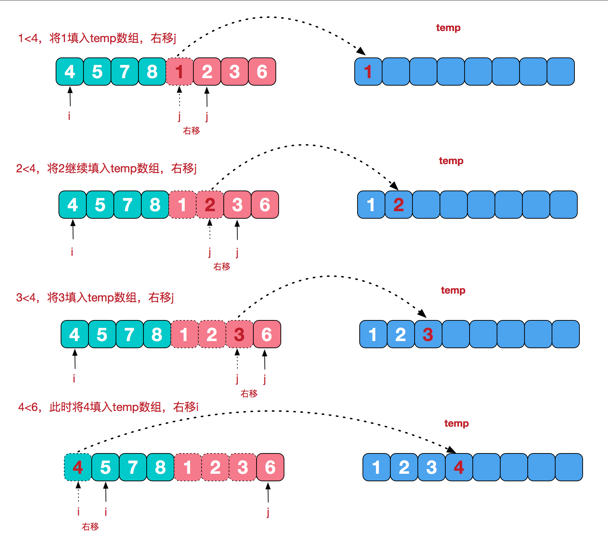

## 归并排序
　　归并排序（MERGE-SORT）是利用归并的思想实现的排序方法，该算法采用经典的分治（divide-and-conquer）策略（分治法将问题分(divide)成一些小的问题然后递归求解，而治(conquer)的阶段则将分的阶段得到的各答案"修补"在一起，即分而治之)。

#### 堆排序特点
- 不是原址排序
- 不稳定排序
- T(n)=nlgn

#### 归并排序步骤：

**1. 合并相邻有序子序列**
需要将两个已经有序的子序列合并成一个有序序列，eg [4,5,7,8]和[1,2,3,6]两个已经有序的子序列，合并为最终序列[1,2,3,4,5,6,7,8]。



**2. 递归 分而治之**


----

#### C++代码实现过程

```C++
/* filename: Merge_sort.cpp
 *
 * Author:   xblin
 */

#include <iostream>
using namespace std;
#define INF 1000000    //定义一个伪无穷大

/*****************合并函数***************************/
void Merge(int A[], int left, int mid, int right){
	int lenth1 = mid - left + 1;
	int lenth2 = right - mid;
	int *L = new int[lenth1+1];   //+1 为了存放结束标志
	int *R = new int[lenth2+1];   //+1 为了存放结束标志

	for (int i = 0; i < lenth1; i++)
		L[i] = A[i + left];
	for (int j = 0; j < lenth2; j++)
		R[j] = A[j + mid + 1];
	L[lenth1] = INF;  //宏定义无穷大，结束标志
	R[lenth2] = INF;  //宏定义无穷大，结束标志
	for (int i=0,j=0,k=left; k <= right; k++){   //从left遍历到right
		if (L[i] < R[j])
			A[k] = L[i++];
		else
			A[k] = R[j++];
	}
	delete[]L;
	delete[]R;
}
/*******************归并递归函数**********************/
void Merge_sort(int A[], int left, int right){
	if (left < right){
		int mid = (left + right) / 2;
		Merge_sort(A, left, mid);
		Merge_sort(A, mid + 1, right);
		Merge(A, left, mid, right);
	}
}
int main(int argc, char **argv){

	int aa[] = {1,3,5,4,6,2};
	int Array_size = sizeof(aa) / sizeof(aa[0]);
	Merge_sort(aa, 0, Array_size-1);
	for (int i = 0; i <= Array_size-1; i++)
		cout << aa[i] << endl;
	return 0;
}
```


